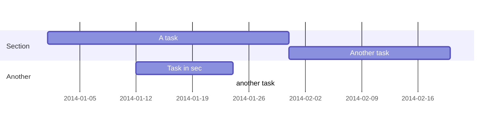
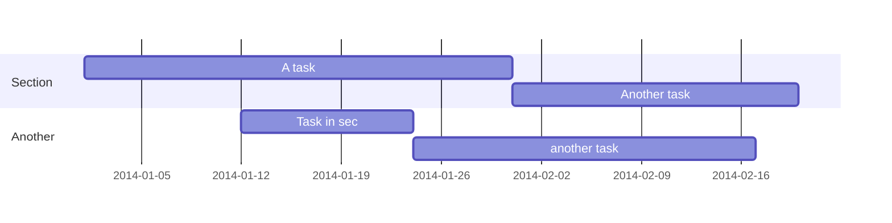

---
# Title, summary, and page position.
# linktitle: 使用Markdown、LaTeX和Shortcodes编写内容
summary: 可以使用Markdown、LaTeX math和Shortcodes在Wowchemy中编写丰富的内容。本文概述了最常见的格式化选项，包括Wowchemy独有的功能。
weight: 1
icon: book
icon_pack: fas

# Page metadata.
title: 使用Markdown、LaTeX和Shortcodes编写内容
date: '2023-07-08T00:00:00Z'
type: book # Do not modify.
bookToc: true
authors:
  - admin

tags:
  - Markdown
  - LaTeX
  - Shortcodes

categories:
  - html
  - Wowchemy
---



## 一、副标题
&emsp;&emsp;在页面标题、标题1之后，我们可以在页面正文中设置子标题的格式：
```markdown
## Heading 2
### Heading 3
#### Heading 4
```
## 二、强调
### 1. 粗体，斜体，划线
```markdown
Italics with _underscores_.

Bold with **asterisks**.

Combined emphasis with **asterisks and _underscores_**.

Strikethrough with ~~two tildes~~.
```
&emsp;&emsp;斜体加下划线；加粗加上星号；用星号和下划线组合强调；划两个波浪。
### 2. 文字颜色
&emsp;&emsp;将样式为{style="color: red"}的HTML color属性添加到Markdown块后的行。例如，将一段涂成红色：
```markdown
Red colored text
{style="color: red"}
```
Red colored text
{style="color: red"}

## 三、块引用
```markdown
> This is a blockquote.
```
> This is a blockquote.

## 四、高光引用
```markdown
highlighted quote
```

## 五、列表

### 1. 有序列表
```markdown
1. First item
   1.1 A sub-item
2. Another item
```
1. First item
   1. A sub-item
2. Another item
### 2. 无序列表

```markdown
- First item
  - A sub-item
- Another item
```
- First item
  - A sub-item
- Another item

## 六、待办事项
&emsp;&emsp;通过使用标准Markdown语法，可以在Wowchemy中编写待办事项列表
```markdown
- [x] Write math example
  - [x] Write diagram example
- [ ] Do something else
```
&emsp;&emsp;上面这个例子的输出为；则输出为

- [x] Write math example
  - [x] Write diagram example
- [ ] Do something else

## 七、切换列表
&emsp;&emsp;向页面添加切换列表，以便在单击切换按钮后显示文本，例如问题的答案。有用的常见问题，剧透，或隐藏答案时，教学在线课程。
```markdown
｛｛< spoiler text="Click to view the spoiler" >｝｝
You found me!
｛｛< /spoiler >｝｝
```

## 八、友情链接
### 1. 网页链接
```markdown
[I'm an external link](https://www.google.com)
[A post](< relref "/post/my-page-name" >) ，注意<>两边都加上双花括号
[A publication](< relref "/publication/my-page-name" >)，注意<>两边都加上双花括号
[A project](< relref "/project/my-page-name" >)，注意<>两边都加上双花括号
[A relative link from one post to another post](< relref "../my-page-name" >)，注意<>两边都加上双花括号
[Scroll down to a page section with heading *Hi*](#hi)
```

&emsp;&emsp;还可以在除Widget Pages(主页)之外的任何页面的页眉中创建按钮链接。

### 2. 链接到文件

&emsp;&emsp;可以在除Widget Pages(主页)之外的任何页面的页头中创建指向文件的按钮链接。另外，要链接到内容**正文**中的文件，例如pdf，请将文件放在`static/uploads/`文件夹中，然后使用以下表单链接到它：
```markdown
% staticref "uploads/cv.pdf" "newtab" % Download my CV% /staticref %，注意%两边都加上双花括号
```
`staticref`的可选参数`"newtab"`将导致链接在新选项卡中打开。

### 3. 引用
&emsp;&emsp;要引用页面或出版物，可以使用引用短代码，引用你创建的文件夹和页面名称：
```markdown
< cite page="/publication/preprint" view="citation" >，注意两边都加上双花括号
```
&emsp;&emsp;其中`view`对应于整个Wowchemy中使用的可用列表视图之一：

- Stream
- Compact
- Card
- Citation

&emsp;&emsp;传统的学术引文，通过`params.yaml`中的`citation_style`设置进行配置，如果不指定视图，则默认为`Compact`视图。

### 4. 目录
&emsp;&emsp;目录可以帮助用户浏览冗长的页面。粘贴`< toc >`短代码在您希望的任意页面中显示目录。您可能还希望考虑使用`book layout`，它在大屏幕的右侧栏中显示内置的目录。

&emsp;&emsp;在使用`book layout`时，您可能仍然希望添加一个页内目录，该目录仅在隐藏右侧栏时显示。您可以使用`< toc hide on="xl" >`来完成此操作。

### 5. 脚注
```markdown
I have more [^1] to say.

[^1]: Footnote example.
```
&emsp;&emsp;上面这个例子的输出为；则输出为

I have more [^1] to say.

[^1]: Footnote example.

### 6. 图片
&emsp;&emsp;要交叉引用图形，请为其提供ID，例如，
```markdown
< figure src="image.jpg" id="wowchemy" >，注意两边都加上双花括号
```
&emsp;&emsp;现在可以通过表单中的链接交叉引用该图
```markdown
[A Figure](#figure-wowchemy)
```

### 7. 标签和类别
&emsp;&emsp;使用
```markdown
< list_tags >，注意两边都加上双花括号
```
提供链接标签的列表，或者使用
```markdown
< list_categories >，注意两边都加上双花括号
```
提供链接类别的列表。

### 8. 行动召唤按钮(Call-to-Action Buttons,CTA)
&emsp;&emsp;使用CTA短代码创建按钮和操作调用(CTA)。

&emsp;&emsp;CTA按钮示例:
```markdown
< cta cta_text="Do something" cta_link="/" cta_new_tab="false" >，注意两边都加上双花括号
```

&emsp;&emsp;示例CTA按钮，带有一个链接到另一个动作
```markdown
< cta cta_text="Do something" cta_link="/" cta_new_tab="false" cta_alt_text="Alternative action" cta_alt_link="/" cta_alt_new_tab="false" >，注意两边都加上双花括号
```
### 9. 提到用户
&emsp;&emsp;要提到某人，键入
```markdown
% mention "username" %，注意两边都加上双花括号
```
其中`username`对应于`Wowchemy`中的用户帐户。

### 10. 列出子页面
&emsp;&emsp;若要列出子页，例如列出书中的章节，请使用
```markdown
< list_children >，注意两边都加上双花括号
```
## 九、图像
### 1. 一张图像
&emsp;&emsp;图像可以通过将其放置在您的`assets/media/`媒体库或页面文件夹中，然后使用以下符号之一引用它们来添加图像。数字可以根据光/暗模式为主题，也可以交叉引用。

&emsp;&emsp;页面文件夹或您的`assets/media/`媒体库中的图像：
```markdown

```

&emsp;&emsp;对于更多可定制的图形，我们可以使用内置的图形短代码，而不是上面的Markdown图形语法。带标题的数字:
```markdown
< figure src="image.jpg" caption="A caption" numbered="true" >，注意<>两边都加上双花括号
```

&emsp;&emsp;根据用户的浅色或深色主题动态主题图像
```markdown
< figure src="image.jpg" caption="test" theme="light" >，注意<>两边都加上双花括号
```
```markdown
< figure src="image.jpg" caption="test" theme="dark" >，注意<>两边都加上双花括号
```

### 2. 图像画廊
&emsp;&emsp;将图片库添加到页面

- 创建一个相册文件夹：`assets/media/albums/`
- 将图像添加到相册文件夹中
- 粘贴`< gallery album="< album - folder >" >`您希望图库显示在页面内容中的位置，并更改album参数以匹配您的相册文件夹的名称。

&emsp;&emsp;如何更改图库图像的大小或形状？调用图库快捷代码时，只需添加resize_options即可。此选项使您可以使用标准Hugo调整大小选项来控制画廊图像的形状/大小。例如：`< gallery album="<ALBUM-FOLDER>" resize_options="250x250" >`
 
 ### 3. 内嵌图像
 &emsp;&emsp;Wowchemy使您能够使用范围广泛的内联图像(又名图标)从字体Awesome和Academicons除了表情符号。下面是一些使用图标短代码渲染图标的示例：
 ```markdown
< icon name="terminal" pack="fas" >， Terminal  
< icon name="python" pack="fab" > ，Python  
< icon name="r-project" pack="fab" >， R
```

### 4. 表情符号
&emsp;&emsp;可以使用表情符号键盘或输入表情符号的名称来插入表情符号。从表情符号小抄中复制并粘贴表情符号名称。下面是一个例子，但要记住移动每个表情符号名称之间的空格和周围的冒号
```markdown
I heart Wowchemy smile
```
I : heart : Wowchemy : smile :
## 十、标注
&emsp;&emsp;Wowchemy支持标注的Markdown扩展，也称为提醒或旁白。标注是一个有用的功能，可以将人们的注意力吸引到重要或相关的内容上，比如文章中的注释、提示或警告。在编写教育性教程风格的文章或文档时，它们特别方便。可以使用下面的callout短代码创建标注。Wowchemy内置了几种不同风格的标注。段落将呈现为带有默认注释样式的标注：
```
% callout note %
A Markdown callout is useful for displaying notices, hints, or definitions to your readers.
% /callout %
```
{}
A Markdown callout is useful for displaying notices, hints, or definitions to your readers.
{}

&emsp;&emsp;或者，可以使用warning选项向读者显示警告:
```
% callout warning %
Here's some important information...
% /callout %
```

## 十一、音频
语法
```
< audio src="markvard.mp3" >
```
## 十二、视频
&emsp;&emsp;以下类型的视频可以添加到一个页面。
### 1. 本地视频文件

&emsp;&emsp;可以将视频放入您的`assets/media/`媒体库或页面文件夹中，然后使用以下符号之一引用它们，将视频添加到页面中。
```
< video src="my_video.mp4" controls="yes" >
```
### 2. 外部视频文件
```
< video src="https://example.com/my_video.mp4" controls="yes" >
```
&emsp;&emsp;请注意，如果视频包含声音，浏览器将阻止自动播放。

### 3. Youtube
```
< youtube w7Ft2ymGmfc >
```

### 4. Vimeo
```
< vimeo 146022717 >
```
## 十三、思维导图
&emsp;&emsp;Wowchemy支持思维导图的Markdown扩展。只需插入Markdown标记图代码块，并可选择设置思维导图的高度，如下面的第一个示例所示。一个简单的思维导图，定义为Markdown列表
```bash
```markmap {height="200px"}
- Hugo Modules
  - wowchemy
  - wowchemy-plugins-netlify
  - wowchemy-plugins-netlify-cms
  - wowchemy-plugins-reveal```
```

&emsp;&emsp;一个更高级的思维导图，包含格式、代码块和数学
```bash

```markmap
- Mindmaps
  - Links
    - [Wowchemy Docs](https://wowchemy.com/docs/)
    - [Discord Community](https://discord.gg/z8wNYzb)
    - [GitHub](https://github.com/wowchemy/wowchemy-hugo-themes)
  - Features
    - Markdown formatting
    - **inline** ~~text~~ *styles*
    - multiline
      text
    - `inline code`
    -
      ```js
      console.log('hello');
      console.log('code block');
      ```
    - Math: $x = {-b \pm \sqrt{b^2-4ac} \over 2a}$```
```
效果：

```markmap
- Mindmaps
  - Links
    - [Wowchemy Docs](https://wowchemy.com/docs/)
    - [Discord Community](https://discord.gg/z8wNYzb)
    - [GitHub](https://github.com/wowchemy/wowchemy-hugo-themes)
  - Features
    - Markdown formatting
    - **inline** ~~text~~ *styles*
    - multiline
      text
    - `inline code`
    -
      ```js
      console.log('hello');
      console.log('code block');
      ```
    - Math: $x = {-b \pm \sqrt{b^2-4ac} \over 2a}$
```
## 十四、嵌入的文件
```bash
< gdocs src="https://docs.google.com/..." >
```

## 十五、数学公式
&emsp;&emsp;Wowchemy支持Markdown扩展的LaTeX数学公式，在`config/_default/params.yaml`选项中的math选项可以启用此功能。

&emsp;&emsp;要呈现内联或块数学，请将LaTeX数学用
```bash
< math >}}
latex公式
< /math >
```
## 十六、示意图
&emsp;&emsp;甘特图示例：
```

效果：

<div id="commento"></div>
<script src="https://cdn.commento.io/js/commento.js"></script>
